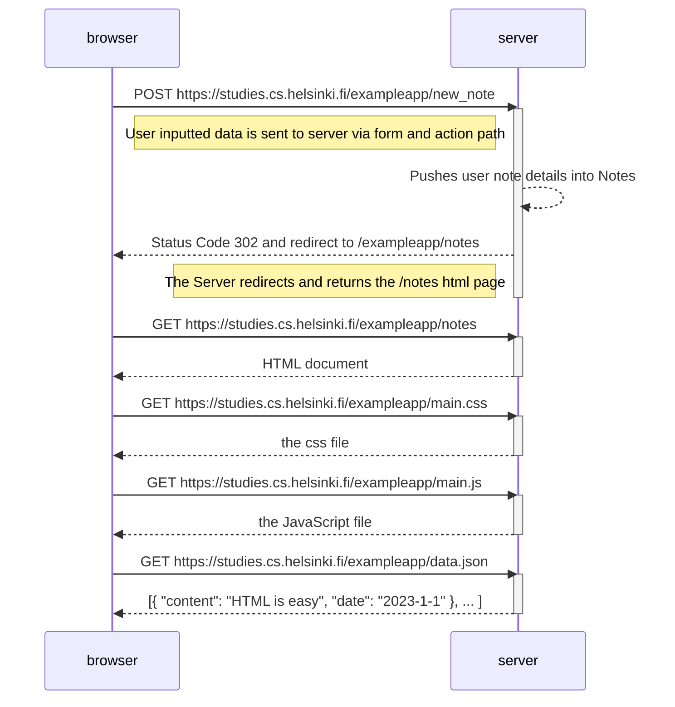

# New note diagram

Create a similar diagram depicting the situation where:
1. the user **creates a new note** on the page https://studies.cs.helsinki.fi/exampleapp/notes
   1. by **writing** something into the **text field**
   2. and **clicking** the **Save button**.

If necessary, show operations on the browser or on the server as comments on the diagram.

